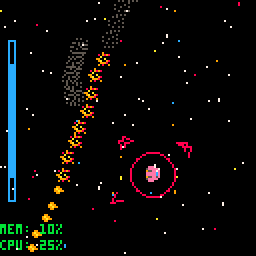
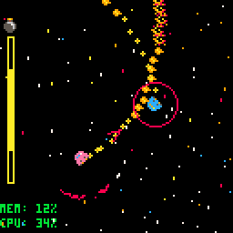
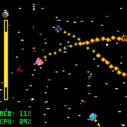

# Pico8-Spacetag
Building a framework for space related games turned into a fun game of tag

Created 24th November, 2018

Author James Brown

A predecessor to Mesonis, this framework for space based games features faster ships, floaty physics, colourful stars, vibrant engine exhausts, and fast-paced gameplay.

The classic game of tag, but in space! A random ship spawns with a bomb. The ship with the bomb, known as the tagship, must seek out another spaceship to crash into to get rid of the bomb. Fortunately, the tagship has increased stats: better acceleration and turning rate. Here, the player's ship in pink has the bomb. A timer is displayed at the side to indicate how much time is left before the bomb goes off. Arrows appear in a circular radius indicating to the player where the nearest ships are, the size of each arrow changes depending on how close the other ships are.

The ship unfortunate enough to be tagged with the bomb has their engines disabled temporarily, to give the other ships a chance to escape. As the timer runs close to 0, the timer begins to flash and an animated bomb appears with a burning fuse. When the time runs out, the player with the bomb explodes, and a new random player is given the bomb.

 
