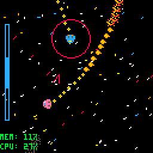
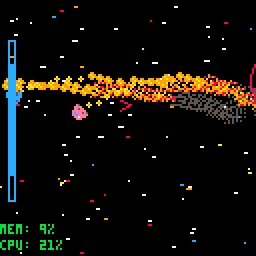
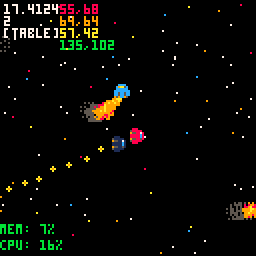
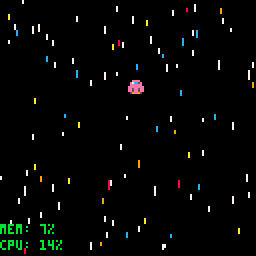

# Pico8-Spacetag
Building a framework for space related games turned into a fun game of tag

Created 24th November, 2018

Author James Brown

A predecessor to Mesonis, this framework for space based games features faster ships, floaty physics, colourful stars, vibrant engine exhausts, and fast-paced gameplay.

The classic game of tag, but in space! A random ship spawns with a bomb. The ship with the bomb, known as the tagship, must seek out another spaceship to crash into to get rid of the bomb. Fortunately, the tagship has increased stats: better acceleration and turning rate. Here, the player's ship in pink has the bomb. A timer is displayed at the side to indicate how much time is left before the bomb goes off. Arrows appear in a circular radius indicating to the player where the nearest ships are, the size of each arrow changes depending on how close the other ships are.

The ship unfortunate enough to be tagged with the bomb has their engines disabled temporarily, to give the other ships a chance to escape. As the timer runs close to 0, the timer begins to flash and an animated bomb appears with a burning fuse. When the time runs out, the player with the bomb explodes, and a new random player is given the bomb.

If you do not have the bomb, an arrow points in the direction of the tagship which does have the bomb, indicating to the player where they should flee. The AI will flee if the tagship is near, but seek each other if they are sufficiently far away, to decrease their chances of getting tagged. This can lead to swarms of ships getting panicked and fleeing when the tagship approaches.

The tagship will seek out the nearest ship, either player or computer-controlled.

## Bonus .gifs

The background which draws stars as lines between their current position on screen and their last position on screen, which is particularly stunning if the player's ship is allowed to fly fast and free. Here, there are other AI ships with low speeds (for experimenting with different ship parameters) and other debug information is printed.

A peaceful cruise through deep space.

